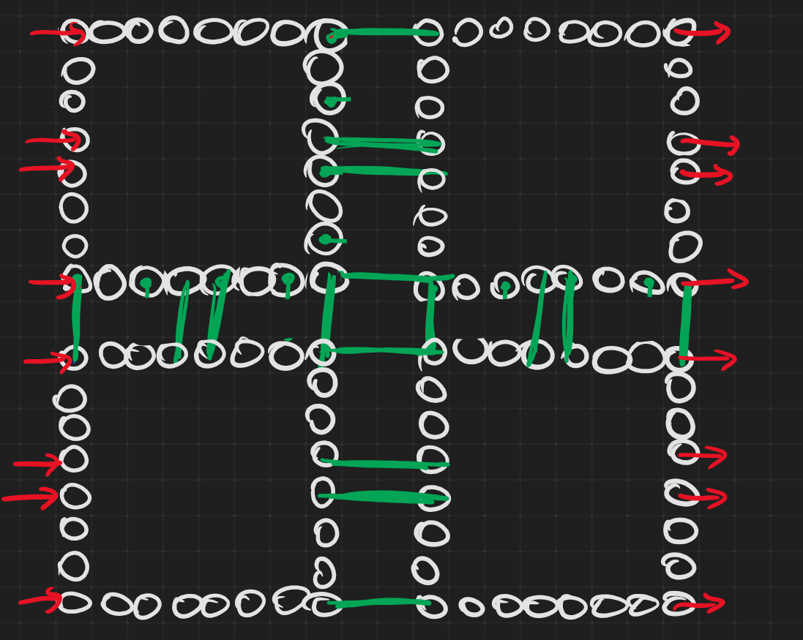

# Four clusters (2x2) of 8x8 PEs each

* The xilinxs FPGA architecture have four groups of logic. Those groups are connectec by a limited number of lines
* The main idea is to make the CGRA follow the same architecture (connected clusters)
* Here we use the one_hop mode.
* Clusters are connected by the corners ans middle PEs

